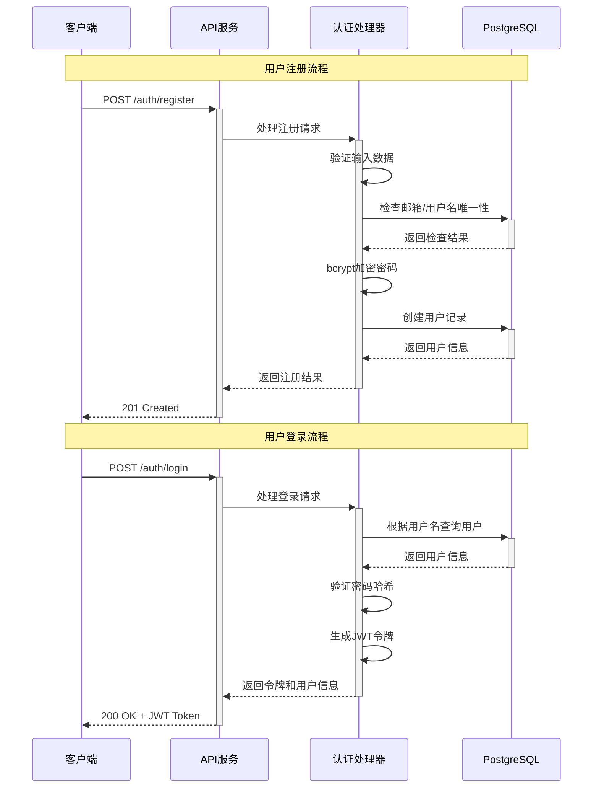
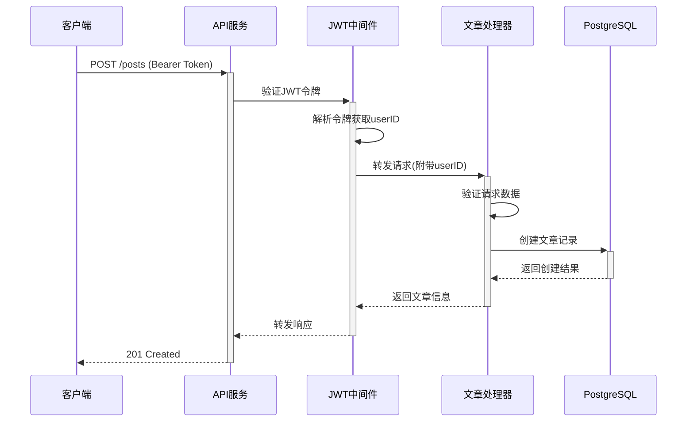

# Demo Gin API 功能架构分析报告

> 📅 生成时间: 2025-09-15
> 🎯 分析对象: demo-gin RESTful API 服务
> 🛠️ 技术栈: Gin + PostgreSQL + sqlc + OpenAPI 3.0

---

## 📋 核心功能清单

### 🔐 认证模块 (Authentication)

| 功能 | 端点 | 方法 | 认证要求 | 实现状态 |
|------|------|------|----------|----------|
| 用户注册 | `/api/v1/auth/register` | POST | 无 | 🔴 TODO |
| 用户登录 | `/api/v1/auth/login` | POST | 无 | 🔴 TODO |

**详细功能说明:**
- **用户注册**:
  - 输入验证: 邮箱格式、用户名长度(3-30)、密码强度(≥8位)
  - 待实现: 密码bcrypt加密、邮箱/用户名唯一性检查、数据库存储

- **用户登录**:
  - 凭证验证: 用户名+密码
  - 待实现: 密码验证、JWT令牌生成、用户状态检查

### 👥 用户管理模块 (User Management)

| 功能 | 端点 | 方法 | 认证要求 | 实现状态 |
|------|------|------|----------|----------|
| 用户列表 | `/api/v1/users` | GET | JWT | 🔴 TODO |
| 用户详情 | `/api/v1/users/{id}` | GET | JWT | 🔴 TODO |
| 用户更新 | `/api/v1/users/{id}` | PUT | JWT | 🔴 TODO |
| 用户删除 | `/api/v1/users/{id}` | DELETE | JWT | 🔴 TODO |

**详细功能说明:**
- **分页支持**: 所有列表接口支持 `page`(页码) 和 `limit`(每页条数) 参数
- **数据验证**: ID参数验证、分页参数边界检查(1-100条/页)
- **待实现**: sqlc数据库查询集成、权限控制逻辑

### 📝 文章管理模块 (Post Management)

| 功能 | 端点 | 方法 | 认证要求 | 实现状态 |
|------|------|------|----------|----------|
| 文章列表 | `/api/v1/posts` | GET | 无 | 🔴 TODO |
| 文章详情 | `/api/v1/posts/{id}` | GET | 无 | 🔴 TODO |
| 创建文章 | `/api/v1/posts` | POST | JWT | 🔴 TODO |
| 更新文章 | `/api/v1/posts/{id}` | PUT | JWT | 🔴 TODO |
| 删除文章 | `/api/v1/posts/{id}` | DELETE | JWT | 🔴 TODO |

**详细功能说明:**
- **文章状态管理**: draft(草稿) / published(已发布) / archived(已归档)
- **权限设计**: 读取公开，创建/编辑/删除需认证
- **内容验证**: 标题长度限制(1-255字符)、内容必填
- **待实现**: 作者权限验证、发布时间管理、状态流转控制

### 🏥 系统功能模块 (System)

| 功能 | 端点 | 方法 | 认证要求 | 实现状态 |
|------|------|------|----------|----------|
| 健康检查 | `/api/v1/health` | GET | 无 | ✅ 已完成 |

---

## 🗄️ 数据库设计分析

### 表结构设计

#### users 表
```sql
CREATE TABLE users (
    id SERIAL PRIMARY KEY,                    -- 用户ID
    email VARCHAR(255) UNIQUE NOT NULL,       -- 邮箱(唯一)
    username VARCHAR(100) UNIQUE NOT NULL,    -- 用户名(唯一)
    password_hash VARCHAR(255) NOT NULL,      -- 密码哈希
    full_name VARCHAR(255),                   -- 全名
    is_active BOOLEAN DEFAULT true,           -- 激活状态
    created_at TIMESTAMP WITH TIME ZONE,      -- 创建时间
    updated_at TIMESTAMP WITH TIME ZONE       -- 更新时间
);
```

#### posts 表
```sql
CREATE TABLE posts (
    id SERIAL PRIMARY KEY,                    -- 文章ID
    user_id INTEGER NOT NULL REFERENCES users(id), -- 作者ID(外键)
    title VARCHAR(255) NOT NULL,              -- 标题
    content TEXT,                             -- 内容
    status VARCHAR(50) DEFAULT 'draft',       -- 状态
    published_at TIMESTAMP WITH TIME ZONE,    -- 发布时间
    created_at TIMESTAMP WITH TIME ZONE,      -- 创建时间
    updated_at TIMESTAMP WITH TIME ZONE       -- 更新时间
);
```

### 索引优化策略
- `idx_users_email`: 邮箱查询优化
- `idx_users_username`: 用户名查询优化
- `idx_posts_user_id`: 按作者查询优化
- `idx_posts_status`: 按状态筛选优化
- `idx_posts_published_at`: 按发布时间排序优化

### 数据完整性保障
- 外键约束: `posts.user_id` → `users.id` (级联删除)
- 自动触发器: `updated_at` 字段自动更新机制
- 唯一约束: 邮箱、用户名唯一性保障

---

## 🔄 系统时序图分析

### 用户注册登录流程


### 认证用户操作文章流程


---

## 🏗️ 项目架构分析

### 目录结构设计
```
demo-gin/
├── cmd/server/main.go         # 应用入口点
├── internal/                  # 私有代码
│   ├── config/               # 配置管理
│   ├── db/                   # 数据库层
│   │   ├── queries/          # SQL查询文件
│   │   └── sqlc/             # sqlc生成代码
│   ├── handlers/             # HTTP处理器
│   └── middleware/           # 中间件
├── migrations/               # 数据库迁移
├── api/openapi.yaml         # API规范
└── pkg/                     # 公共代码包
```

### 技术栈组合优势
- **Gin**: 高性能HTTP框架，丰富的中间件生态
- **PostgreSQL**: 企业级关系数据库，ACID事务保障
- **sqlc**: 类型安全的SQL代码生成，避免ORM性能损耗
- **OpenAPI 3.0**: 标准化API文档，支持代码生成

### 中间件链路设计
1. **gin.Logger()**: HTTP请求日志记录
2. **gin.Recovery()**: Panic恢复机制
3. **middleware.CORS()**: 跨域资源共享
4. **middleware.Auth()**: JWT令牌验证(部分路由)

---

## 📊 实现状态评估

### ✅ 已完成部分 (30%)
- **API设计**: 完整的OpenAPI 3.0规范定义
- **数据库设计**: 表结构、索引、触发器完备
- **项目架构**: 标准Go项目布局，分层设计清晰
- **路由配置**: Gin路由组织、中间件集成
- **请求响应结构**: 完整的数据传输对象定义
- **开发工具链**: Makefile、Docker支持

### 🔴 待实现核心功能 (70%)
- **数据库集成**: sqlc代码生成和数据库操作
- **认证授权**: JWT中间件、密码加密验证
- **业务逻辑**: 所有CRUD操作的具体实现
- **错误处理**: 统一错误响应、异常处理机制
- **输入验证**: 深度数据验证、业务规则检查
- **日志系统**: 结构化日志、请求追踪
- **测试覆盖**: 单元测试、集成测试

### ⚠️ 技术债务识别
1. **数据库连接**: 当前使用nil，需要恢复正常连接
2. **Mock数据**: 所有处理器返回硬编码数据
3. **安全机制**: 缺少输入清理、SQL注入防护
4. **监控告警**: 缺少性能指标、健康检查扩展
5. **部署配置**: 缺少生产环境配置管理

---

## 🎯 开发优先级建议

### 高优先级 (P0)
1. **数据库连接恢复**: 配置PostgreSQL连接池
2. **sqlc集成**: 完成代码生成和查询实现
3. **JWT认证**: 实现完整的认证授权机制
4. **核心CRUD**: 用户和文章的基本操作

### 中优先级 (P1)
1. **错误处理**: 统一错误响应格式
2. **输入验证**: 加强数据验证逻辑
3. **单元测试**: 核心业务逻辑测试覆盖
4. **日志优化**: 结构化日志实现

### 低优先级 (P2)
1. **性能优化**: 查询优化、缓存策略
2. **API文档**: Swagger UI集成
3. **部署脚本**: Docker优化、CI/CD
4. **监控指标**: 业务监控、告警机制

---

## 📝 总结

demo-gin项目具备了**优秀的架构设计基础**，API规范完整，数据库设计合理，技术选型恰当。项目当前处于"**架构完备，业务待实现**"的阶段，为快速开发提供了坚实的基础。

**核心价值**:
- 标准化的RESTful API设计
- 类型安全的数据库操作方案
- 可扩展的微服务架构
- 完整的开发工具链支持

**下一步行动**:
建议按照优先级逐步实现核心功能，重点关注数据库集成和认证机制，为项目的快速迭代奠定基础。

---

*本报告基于项目当前状态分析生成，建议定期更新以反映开发进展。*