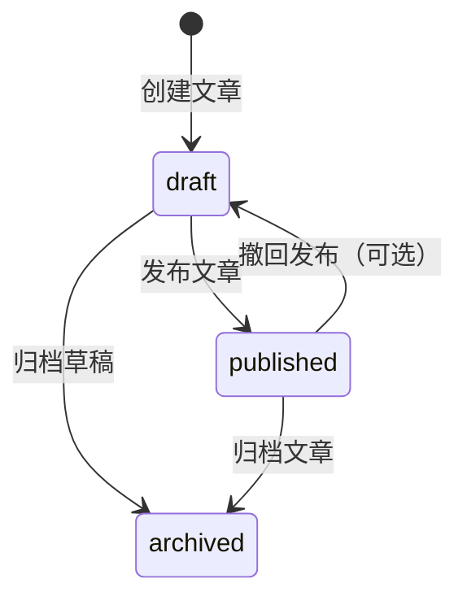

# Demo Gin API 数据库设计文档

> 🗄️ 数据库: PostgreSQL
> 🛠️ 工具链: sqlc + 数据库迁移
> 📊 设计原则: 规范化、性能优化、数据完整性

---

## 📋 数据库概览

| 项目 | 详情 |
|------|------|
| 数据库类型 | PostgreSQL |
| 表数量 | 2 |
| 索引数量 | 5 |
| 触发器数量 | 2 |
| 外键约束 | 1 |

---

## 🗂️ 表结构设计

### 👤 users 表 (用户信息)

```sql
CREATE TABLE IF NOT EXISTS users (
    id SERIAL PRIMARY KEY,
    email VARCHAR(255) UNIQUE NOT NULL,
    username VARCHAR(100) UNIQUE NOT NULL,
    password_hash VARCHAR(255) NOT NULL,
    full_name VARCHAR(255),
    is_active BOOLEAN DEFAULT true,
    created_at TIMESTAMP WITH TIME ZONE DEFAULT CURRENT_TIMESTAMP,
    updated_at TIMESTAMP WITH TIME ZONE DEFAULT CURRENT_TIMESTAMP
);
```

#### 字段说明

| 字段 | 类型 | 约束 | 说明 |
|------|------|------|------|
| `id` | SERIAL | PRIMARY KEY | 用户唯一标识符，自增主键 |
| `email` | VARCHAR(255) | UNIQUE NOT NULL | 用户邮箱，用于登录和通知 |
| `username` | VARCHAR(100) | UNIQUE NOT NULL | 用户名，用于登录和显示 |
| `password_hash` | VARCHAR(255) | NOT NULL | bcrypt加密后的密码哈希 |
| `full_name` | VARCHAR(255) | NULL | 用户真实姓名，可选字段 |
| `is_active` | BOOLEAN | DEFAULT true | 账户激活状态，支持软删除 |
| `created_at` | TIMESTAMPTZ | DEFAULT NOW() | 账户创建时间 |
| `updated_at` | TIMESTAMPTZ | DEFAULT NOW() | 最后更新时间，触发器自动维护 |

#### 业务规则
- 邮箱和用户名必须全局唯一
- 密码使用 bcrypt 算法加密存储
- 支持软删除机制（is_active字段）
- 时间字段包含时区信息

### 📝 posts 表 (文章内容)

```sql
CREATE TABLE IF NOT EXISTS posts (
    id SERIAL PRIMARY KEY,
    user_id INTEGER NOT NULL REFERENCES users(id) ON DELETE CASCADE,
    title VARCHAR(255) NOT NULL,
    content TEXT,
    status VARCHAR(50) DEFAULT 'draft',
    published_at TIMESTAMP WITH TIME ZONE,
    created_at TIMESTAMP WITH TIME ZONE DEFAULT CURRENT_TIMESTAMP,
    updated_at TIMESTAMP WITH TIME ZONE DEFAULT CURRENT_TIMESTAMP
);
```

#### 字段说明

| 字段 | 类型 | 约束 | 说明 |
|------|------|------|------|
| `id` | SERIAL | PRIMARY KEY | 文章唯一标识符，自增主键 |
| `user_id` | INTEGER | FK NOT NULL | 文章作者ID，外键关联users表 |
| `title` | VARCHAR(255) | NOT NULL | 文章标题，限制长度防止过长 |
| `content` | TEXT | NULL | 文章正文内容，支持长文本 |
| `status` | VARCHAR(50) | DEFAULT 'draft' | 文章状态：draft/published/archived |
| `published_at` | TIMESTAMPTZ | NULL | 文章发布时间，仅发布时设置 |
| `created_at` | TIMESTAMPTZ | DEFAULT NOW() | 文章创建时间 |
| `updated_at` | TIMESTAMPTZ | DEFAULT NOW() | 最后更新时间，触发器自动维护 |

#### 文章状态流转


#### 外键约束
- `user_id` → `users.id` (ON DELETE CASCADE)
- 当用户被删除时，其所有文章自动删除

---

## 🚀 索引设计策略

### 性能优化索引

```sql
-- 用户表索引
CREATE INDEX idx_users_email ON users(email);
CREATE INDEX idx_users_username ON users(username);

-- 文章表索引
CREATE INDEX idx_posts_user_id ON posts(user_id);
CREATE INDEX idx_posts_status ON posts(status);
CREATE INDEX idx_posts_published_at ON posts(published_at);
```

### 索引使用场景分析

| 索引 | 使用场景 | 性能提升 |
|------|----------|----------|
| `idx_users_email` | 邮箱登录查询 | O(log n) 查找 |
| `idx_users_username` | 用户名登录查询 | O(log n) 查找 |
| `idx_posts_user_id` | 按作者查询文章 | 避免全表扫描 |
| `idx_posts_status` | 按状态筛选文章 | 状态过滤加速 |
| `idx_posts_published_at` | 按发布时间排序 | 时间范围查询优化 |

### 复合索引考虑
```sql
-- 针对常见查询模式的复合索引（可选）
CREATE INDEX idx_posts_status_published ON posts(status, published_at DESC)
WHERE status = 'published';
```

---

## ⚡ 触发器设计

### 自动更新时间触发器

```sql
-- 触发器函数：自动更新 updated_at 字段
CREATE OR REPLACE FUNCTION update_updated_at_column()
RETURNS TRIGGER AS $$
BEGIN
    NEW.updated_at = CURRENT_TIMESTAMP;
    RETURN NEW;
END;
$$ language 'plpgsql';

-- 用户表触发器
CREATE TRIGGER update_users_updated_at
    BEFORE UPDATE ON users
    FOR EACH ROW
    EXECUTE FUNCTION update_updated_at_column();

-- 文章表触发器
CREATE TRIGGER update_posts_updated_at
    BEFORE UPDATE ON posts
    FOR EACH ROW
    EXECUTE FUNCTION update_updated_at_column();
```

### 触发器执行时机
- **BEFORE UPDATE**: 在更新操作执行前自动设置时间
- **FOR EACH ROW**: 每行更新都会触发
- **自动维护**: 无需应用层手动管理时间字段

---

## 🛡️ 数据完整性保障

### 约束设计

#### 主键约束
- 每个表都有自增主键 (`SERIAL`)
- 保证行的唯一性和引用完整性

#### 唯一约束
```sql
-- 用户表唯一约束
ALTER TABLE users ADD CONSTRAINT uk_users_email UNIQUE (email);
ALTER TABLE users ADD CONSTRAINT uk_users_username UNIQUE (username);
```

#### 外键约束
```sql
-- 文章表外键约束
ALTER TABLE posts ADD CONSTRAINT fk_posts_user_id
    FOREIGN KEY (user_id) REFERENCES users(id) ON DELETE CASCADE;
```

#### 检查约束 (可选扩展)
```sql
-- 文章状态约束
ALTER TABLE posts ADD CONSTRAINT ck_posts_status
    CHECK (status IN ('draft', 'published', 'archived'));

-- 邮箱格式约束
ALTER TABLE users ADD CONSTRAINT ck_users_email_format
    CHECK (email ~* '^[A-Za-z0-9._%+-]+@[A-Za-z0-9.-]+\.[A-Za-z]{2,}$');
```

---

## 📊 查询性能分析

### 常见查询模式

#### 1. 用户认证查询
```sql
-- 登录验证查询 (使用 idx_users_username)
EXPLAIN ANALYZE
SELECT id, password_hash, is_active
FROM users
WHERE username = $1 AND is_active = true;
```

#### 2. 文章列表查询
```sql
-- 已发布文章列表 (使用 idx_posts_status, idx_posts_published_at)
EXPLAIN ANALYZE
SELECT p.*, u.username
FROM posts p
JOIN users u ON p.user_id = u.id
WHERE p.status = 'published'
ORDER BY p.published_at DESC
LIMIT 10 OFFSET 0;
```

#### 3. 用户文章查询
```sql
-- 用户所有文章 (使用 idx_posts_user_id)
EXPLAIN ANALYZE
SELECT * FROM posts
WHERE user_id = $1
ORDER BY created_at DESC;
```

### 查询优化建议

#### 分页查询优化
```sql
-- 使用游标分页替代 OFFSET (大数据量时)
SELECT * FROM posts
WHERE published_at < $1 AND status = 'published'
ORDER BY published_at DESC
LIMIT 10;
```

#### 连接查询优化
```sql
-- 预加载用户信息，减少N+1查询
SELECT
    p.id, p.title, p.content, p.status,
    p.published_at, p.created_at,
    u.username, u.full_name
FROM posts p
INNER JOIN users u ON p.user_id = u.id
WHERE p.status = 'published'
ORDER BY p.published_at DESC;
```

---

## 🔧 sqlc 集成配置

### sqlc.yaml 配置
```yaml
version: "2"
sql:
  - engine: "postgresql"
    queries: "internal/db/queries"
    schema: "migrations"
    gen:
      go:
        package: "sqlc"
        out: "internal/db/sqlc"
        sql_package: "pgx/v5"
        emit_json_tags: true
        emit_prepared_queries: false
        emit_interface: true
        emit_exact_table_names: false
```

### 查询文件示例 (internal/db/queries/)

#### users.sql
```sql
-- name: CreateUser :one
INSERT INTO users (email, username, password_hash, full_name)
VALUES ($1, $2, $3, $4)
RETURNING *;

-- name: GetUserByUsername :one
SELECT * FROM users
WHERE username = $1 AND is_active = true;

-- name: GetUserByEmail :one
SELECT * FROM users
WHERE email = $1 AND is_active = true;

-- name: ListUsers :many
SELECT * FROM users
WHERE is_active = true
ORDER BY created_at DESC
LIMIT $1 OFFSET $2;
```

#### posts.sql
```sql
-- name: CreatePost :one
INSERT INTO posts (user_id, title, content, status)
VALUES ($1, $2, $3, $4)
RETURNING *;

-- name: GetPost :one
SELECT * FROM posts WHERE id = $1;

-- name: ListPublishedPosts :many
SELECT * FROM posts
WHERE status = 'published'
ORDER BY published_at DESC
LIMIT $1 OFFSET $2;

-- name: UpdatePost :one
UPDATE posts
SET title = COALESCE($2, title),
    content = COALESCE($3, content),
    status = COALESCE($4, status),
    published_at = CASE
        WHEN $4 = 'published' AND status != 'published'
        THEN CURRENT_TIMESTAMP
        ELSE published_at
    END
WHERE id = $1
RETURNING *;
```

---

## 📈 数据库维护

### 迁移管理
```bash
# 创建新迁移
migrate create -ext sql -dir migrations -seq add_user_avatar

# 执行迁移
migrate -path migrations -database "postgres://..." up

# 回滚迁移
migrate -path migrations -database "postgres://..." down 1
```

### 性能监控
```sql
-- 查看慢查询
SELECT query, mean_time, calls
FROM pg_stat_statements
ORDER BY mean_time DESC
LIMIT 10;

-- 查看索引使用情况
SELECT schemaname, tablename, attname, n_distinct, correlation
FROM pg_stats
WHERE schemaname = 'public';
```

### 备份策略
```bash
# 数据库备份
pg_dump -h localhost -U username -d database_name > backup.sql

# 数据库恢复
psql -h localhost -U username -d database_name < backup.sql
```

---

## 🔮 扩展规划

### 可能的表扩展

#### 用户头像表 (user_avatars)
```sql
CREATE TABLE user_avatars (
    user_id INTEGER PRIMARY KEY REFERENCES users(id),
    avatar_url VARCHAR(500),
    uploaded_at TIMESTAMPTZ DEFAULT CURRENT_TIMESTAMP
);
```

#### 文章分类表 (categories)
```sql
CREATE TABLE categories (
    id SERIAL PRIMARY KEY,
    name VARCHAR(100) UNIQUE NOT NULL,
    slug VARCHAR(100) UNIQUE NOT NULL,
    description TEXT
);

-- 文章分类关联表
CREATE TABLE post_categories (
    post_id INTEGER REFERENCES posts(id),
    category_id INTEGER REFERENCES categories(id),
    PRIMARY KEY (post_id, category_id)
);
```

#### 文章评论表 (comments)
```sql
CREATE TABLE comments (
    id SERIAL PRIMARY KEY,
    post_id INTEGER NOT NULL REFERENCES posts(id),
    user_id INTEGER NOT NULL REFERENCES users(id),
    content TEXT NOT NULL,
    parent_id INTEGER REFERENCES comments(id),
    created_at TIMESTAMPTZ DEFAULT CURRENT_TIMESTAMP
);
```

### 性能优化方向
1. **读写分离**: 主从复制配置
2. **连接池优化**: pgbouncer 集成
3. **查询缓存**: Redis 缓存热点数据
4. **分区表**: 大数据量时的水平分区

---

*本文档随数据库结构演进持续更新，确保与实际实现保持同步。*